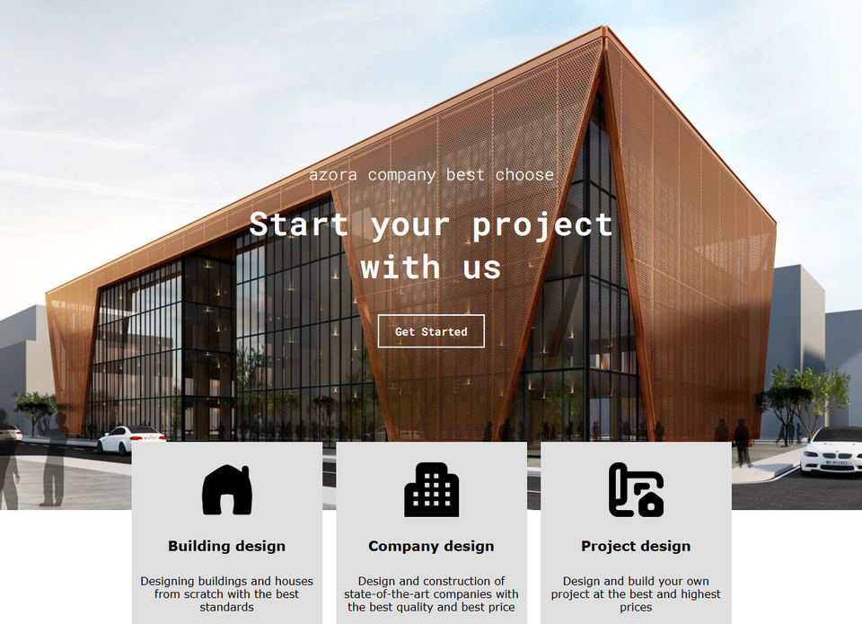
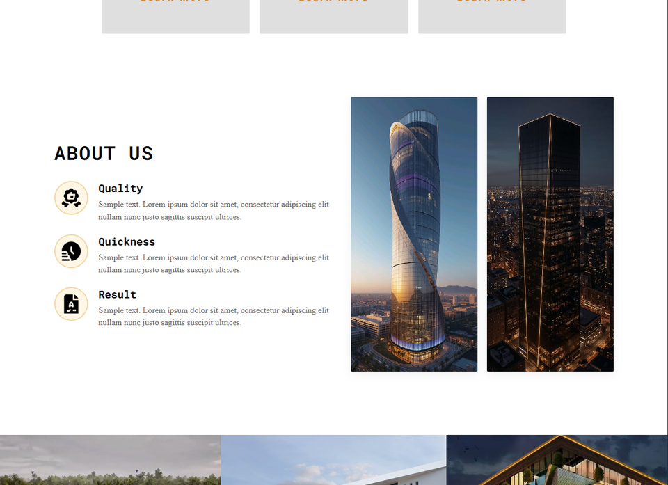
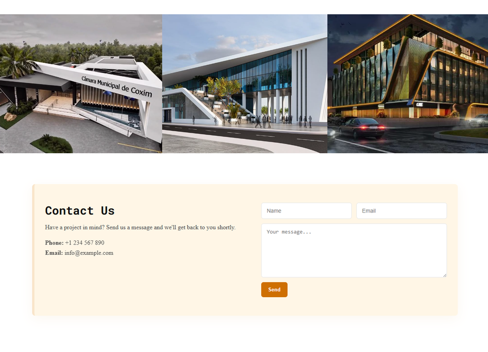

# Company-Landing-Page-Website
This is a responsive company website built using HTML, CSS,.   It presents company information, services, and contact details in a modern and clean design.

## Purpose of the Project
I built this project to practice:
- Creating structured web pages
- Responsive design
- Improving UI layout skills

## Technologies Used
- HTML5
- CSS3

## Features
- Responsive design (works on mobile and desktop)
- Navigation bar
- Sections for services and company info
- Clean modern layout

## Live Demo
👉 https://azor-a.netlify.app/

## Screenshot

## What I Learned
- How to structure a real company website
- Improving layout using CSS
- Solving design and spacing problems

## CONTACT HERE

Telegram : @zg22x 

INSTAGRAM : zg22x

